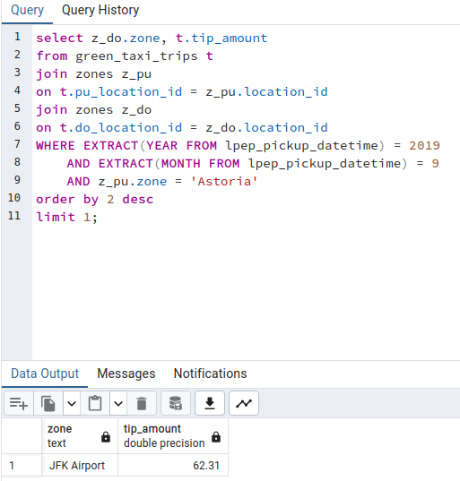

## Module 1 Homework
the homework link is [here](https://github.com/DataTalksClub/data-engineering-zoomcamp/blob/main/cohorts/2024/01-docker-terraform/homework.md)

# Table of Contents
- [Question 1](#q1)
- [Question 2](#q2)
- [prepare postegreSQL](#p)
- [Question 3](#q3)
- [Question 4](#q4)
- [Question 5](#q5)
- [Question 6](#q6)
- [Question 7](#q7)

<a id="q1"></a>
## Question 1. Knowing docker tags

***Answer***   
--rm

***Steps***   
1- open terminal   
2- run "docker run --help" command   
3- search for the target text   


<a id="q2"></a>
## Question 2. Understanding docker first run 

***Answer***   
0.42.0

***Steps***   
1- open terminal   
2- run following command:```docker run -it --entrypoint="bash" python:3.9```   
3- in the bash run: ```pip list```  


<a id="p"></a>
# Prepare Postgres

***steps***   
0- download datasets using wget:   
```wget https://github.com/DataTalksClub/nyc-tlc-data/releases/download/green/green_tripdata_2019-09.csv.gz```   
```wget https://s3.amazonaws.com/nyc-tlc/misc/taxi+_zone_lookup.csv```   
1- build the dockerfile ```docker build -t taxi_ingest:v001```   
2- run the docker-compose ```docker-compose up```
3- run a python server ```python -m http.server```
4- run the ingest container to ingest taxi data
```
URL="http://<your-ip>:8000/green_tripdata_2019-09.csv.gz"
docker run -it \
  --network=pg-network \
  taxi_ingest:v001 \
    --user=root \
    --password=root \
    --host=pgdatabase \
    --port=5432 \
    --db=ny_taxi_green \
    --table_name=green_taxi_trips \
    --url=${URL}
```   
5- run the ingest container to ingest zone data
```
URL="http://<your-ip>:8000/taxi%2B_zone_lookup.csv"
docker run -it \
  --network=pg-network \
  taxi_ingest:v001 \
    --user=root \
    --password=root \
    --host=pgdatabase \
    --port=5432 \
    --db=ny_taxi_green \
    --table_name=zones \
    --url=${URL}
```  
<a id="q3"></a>
## Question 3. Count records 

***Answer***   
15612

***Steps***   
1- open PgAdmin   
2- run this query 
```
SELECT COUNT(*)
FROM green_taxi_trips
WHERE DATE(lpep_pickup_datetime) = '2019-09-18' AND DATE(lpep_dropoff_datetime) = '2019-09-18';

```   


<a id="q4"></a>
## Question 4. Largest trip for each day

***Answer***   
2019-09-26

***Steps***   
1- open PgAdmin   
2- run this query 
```
SELECT DATE(lpep_pickup_datetime), sum(trip_distance)
FROM green_taxi_trips
group by 1
order by 2 desc
limit 1;

```   


<a id="q5"></a>
## Question 5. Three biggest pick up Boroughs
***Answer***   
"Brooklyn" "Manhattan" "Queens"

***Steps***  
1- open PgAdmin   
2- run this query 
```
select z.borough, sum(t.total_amount)
from green_taxi_trips t
join zones z
on t.pu_location_id = z.location_id
where DATE(lpep_pickup_datetime) = '2019-09-18' and z.borough != 'Unknown'
group by 1
having sum(t.total_amount) > 50000
order by 2 desc
limit 3;
```


<a id="q6"></a>
## Question 6. Largest tip

***Answer***   
JFK Airport

***Steps***  
1- open PgAdmin   
2- run this query   
```
select z_do.zone, sum(t.tip_amount)
from green_taxi_trips t
join zones z_pu
on t.pu_location_id = z_pu.location_id
join zones z_do
on t.do_location_id = z_do.location_id
WHERE EXTRACT(YEAR FROM lpep_pickup_datetime) = 2019 
  	AND EXTRACT(MONTH FROM lpep_pickup_datetime) = 9
	AND z_pu.zone = 'Astoria'
group by 1
order by 2 desc
limit 100;
```


<a id="q7"></a>
## Question 7. Creating Resources

***Steps***  
run ```terraform apply``` after modifying files as here [main.tf](main.tf) [variables.tf](variables.tf)
***Output***
```
var.project
  Your GCP Project ID

  Enter a value: solid-mantra-412218


Terraform used the selected providers to generate the following execution plan.
Resource actions are indicated with the following symbols:
  + create

Terraform will perform the following actions:

  # google_bigquery_dataset.dataset will be created
  + resource "google_bigquery_dataset" "dataset" {
      + creation_time              = (known after apply)
      + dataset_id                 = "trips_data_all"
      + delete_contents_on_destroy = false
      + etag                       = (known after apply)
      + id                         = (known after apply)
      + labels                     = (known after apply)
      + last_modified_time         = (known after apply)
      + location                   = "northamerica-northeast1"
      + project                    = "solid-mantra-412218"
      + self_link                  = (known after apply)

      + access {
          + domain         = (known after apply)
          + group_by_email = (known after apply)
          + role           = (known after apply)
          + special_group  = (known after apply)
          + user_by_email  = (known after apply)

          + dataset {
              + target_types = (known after apply)

              + dataset {
                  + dataset_id = (known after apply)
                  + project_id = (known after apply)
                }
            }

          + routine {
              + dataset_id = (known after apply)
              + project_id = (known after apply)
              + routine_id = (known after apply)
            }

          + view {
              + dataset_id = (known after apply)
              + project_id = (known after apply)
              + table_id   = (known after apply)
            }
        }
    }

  # google_storage_bucket.data-lake-bucket will be created
  + resource "google_storage_bucket" "data-lake-bucket" {
      + force_destroy               = true
      + id                          = (known after apply)
      + location                    = "NORTHAMERICA-NORTHEAST1"
      + name                        = "dtc_data_lake_solid-mantra-412218"
      + project                     = (known after apply)
      + public_access_prevention    = (known after apply)
      + self_link                   = (known after apply)
      + storage_class               = "STANDARD"
      + uniform_bucket_level_access = true
      + url                         = (known after apply)

      + lifecycle_rule {
          + action {
              + type = "Delete"
            }

          + condition {
              + age                   = 30
              + matches_prefix        = []
              + matches_storage_class = []
              + matches_suffix        = []
              + with_state            = (known after apply)
            }
        }

      + versioning {
          + enabled = true
        }

      + website {
          + main_page_suffix = (known after apply)
          + not_found_page   = (known after apply)
        }
    }

Plan: 2 to add, 0 to change, 0 to destroy.

Do you want to perform these actions?
  Terraform will perform the actions described above.
  Only 'yes' will be accepted to approve.

  Enter a value: yes

google_bigquery_dataset.dataset: Creating...
google_storage_bucket.data-lake-bucket: Creating...
google_bigquery_dataset.dataset: Creation complete after 1s [id=projects/solid-mantra-412218/datasets/trips_data_all]
google_storage_bucket.data-lake-bucket: Creation complete after 1s [id=dtc_data_lake_solid-mantra-412218]

Apply complete! Resources: 2 added, 0 changed, 0 destroyed.
```