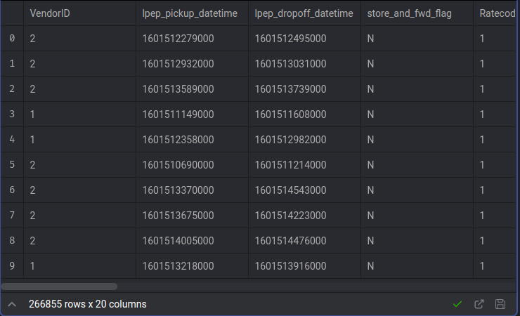
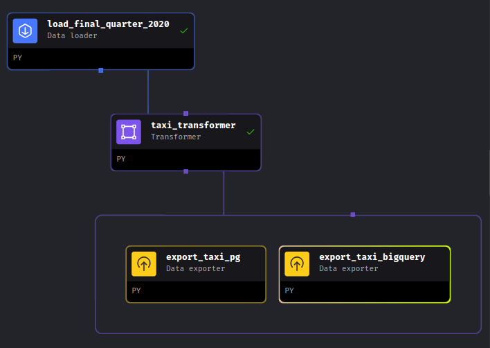

## Module 1 Homework
The homework link is [here](https://github.com/DataTalksClub/data-engineering-zoomcamp/blob/main/cohorts/2024/02-workflow-orchestration/homework.md)

# Table of Contents
- [Overview](#overview)
- [Question 1](#q1)
- [Question 2](#q2)
- [Question 3](#q3)
- [Question 4](#q4)
- [Question 5](#q5)
- [Question 6](#q6)

## Overview
ok this my solutions to module2 task at DE zoom camp, in this task we want to create a data pipeline at mage, so first run mage, then download the datasets used (you can find them [here](./dataset/)) and let's begin the fun.

#### extract the data
we need to get the data from the CSV files to a pandas dataframe, that's my [python script](./mage-zoomcamp/magic-zoomcamp/data_loaders/load_final_quarter_2020.py)
and that's the result sample 

#### transform the data
now we need to clean the data a little by removing columns that don't make sense, renaming some columns and add new columns, that's my [python script](./mage-zoomcamp/magic-zoomcamp/transformers/taxi_transformer.py) and that's the result sample

#### load the data
Finally we need to save this data to our databases we used 2 databases (PostgreSql and BigQuery), you can find the 2 scripts [here](./mage-zoomcamp/magic-zoomcamp/data_exporters/)

#### Schedule the pipeline.
we need to run our pipeline on daily basis so we used cron scheduling with `0 5 * * *` setup to run everyday at 5.AM.

The whole pipeline is simple but you can learn many things from it.

## Question 1. Data Loading

Once the dataset is loaded, what's the shape of the data?

* 266,855 rows x 20 columns
* 544,898 rows x 18 columns
* 544,898 rows x 20 columns
* 133,744 rows x 20 columns

#### Answer: `266,855 rows x 20 columns`

## Question 2. Data Transformation

Upon filtering the dataset where the passenger count is greater than 0 _and_ the trip distance is greater than zero, how many rows are left?

* 544,897 rows
* 266,855 rows
* 139,370 rows
* 266,856 rows

#### Answer: `139,370 rows`

## Question 3. Data Transformation

Which of the following creates a new column `lpep_pickup_date` by converting `lpep_pickup_datetime` to a date?

* `data = data['lpep_pickup_datetime'].date`
* `data('lpep_pickup_date') = data['lpep_pickup_datetime'].date`
* `data['lpep_pickup_date'] = data['lpep_pickup_datetime'].dt.date`
* `data['lpep_pickup_date'] = data['lpep_pickup_datetime'].dt().date()`

#### Answer: `data['lpep_pickup_date'] = data['lpep_pickup_datetime'].dt.date`

## Question 4. Data Transformation

What are the existing values of `VendorID` in the dataset?

* 1, 2, or 3
* 1 or 2
* 1, 2, 3, 4
* 1

#### Answer: `1 or 2`

## Question 5. Data Transformation

How many columns need to be renamed to snake case?

* 3
* 6
* 2
* 4

#### Answer: `4`

## Question 6. Data Exporting

Once exported, how many partitions (folders) are present in Google Cloud?

* 96
* 56
* 67
* 108

#### Answer: `96`
